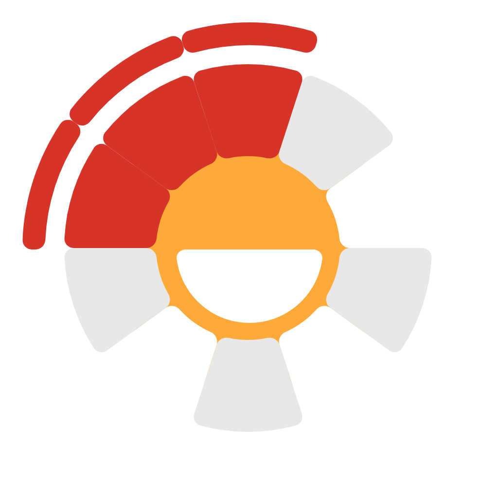

<p align="center"></p>

# <p align="center"> Triplet Sum Puzzle Game <p align="center">

<p align="center">
    <strong>Live Demo</strong>: <a href="https://graphictins.github.io/sum17/">graphictins.github.io/sum17/</a>
</p>

<br>


<p align="center">
    A technical prototype and interaction study built with 
    $\color{Orange}\large{\textbf{Rust}}$ and 
    $\color{Red}\large{\textbf{Macroquad}}$. <br>
    This project explores <code>circular constraint</code> logic and 
    <code>bi-directional data management</code> in a 2D game environment.
</p>


<!-- 
A technical prototype and interaction study 
built with $\color{Orange}\large{\textbf{Rust}}$ and $\color{Red}\large{\textbf{Macroquad}}$. <br>
This project explores `circular constraint` logic and `bi-directional data management` in a 2D game environment. 
-->


$\color{Orange}{\textsf{}}$
$\color{Orange}{\textbf{}}$
$\color{Orange}\large{\textbf{}}$

<span style="color:red"></span>
<span style="color:orange"></span>

<br><br>

## 🚀 Core Features
* **Circular Constraint Engine** : A 10-slot array using modulo arithmetic to calculate adjacent triplet sums $(n-1, n, n+1)$.
* **Bi-Directional Interaction** : Seamlessly moving `Number` objects between a linear deck `Vec` and a fixed circular `Option` array.
* **Reactive Feedback**: Real-time color tinting to signal "Overload" states (Sum > 17).

## 🛠 Technical Stack
* **Language** : Rust
* **Framework** : Macroquad
* **Target** : WebAssembly
* **Host** : GitHub Pages

## 📁 Assets & Licensing
* **Fonts**: `BungeeFont` Downloaded via **Google Fonts**. Licensed under the **SIL Open Font License (OFL)** i think...
* **Graphics**: Custom-Handmade `.png` assets for 10-slice circle geometry. tho used one
* **Engine**: Macroquad (MIT/Apache 2.0). i dont know

## 🔨 Build 
To compile for the web:
```bash
cargo build --release --target wasm32-unknown-unknown
```
## 🚀 Deploy
GitHub Actions builds and publishes to GitHub Pages automatically on every push to `main` (see `.github/workflows/deploy.yml`). No manual upload needed.
## 🖥️ LocalHost
Can use python to test localhosted game
```bash
# stage the site next to the static files
mkdir -p web
cp static/index.html static/mq_js_bundle.js web/
cp target/wasm32-unknown-unknown/release/sum17.wasm web/
cp -R assets web/

# run server
cd web
python -m http.server
```
> then you can test at [localhost:8000](http://localhost:8000/)
